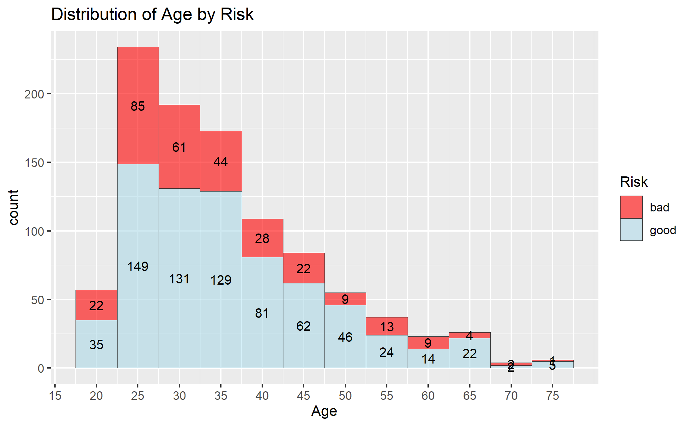
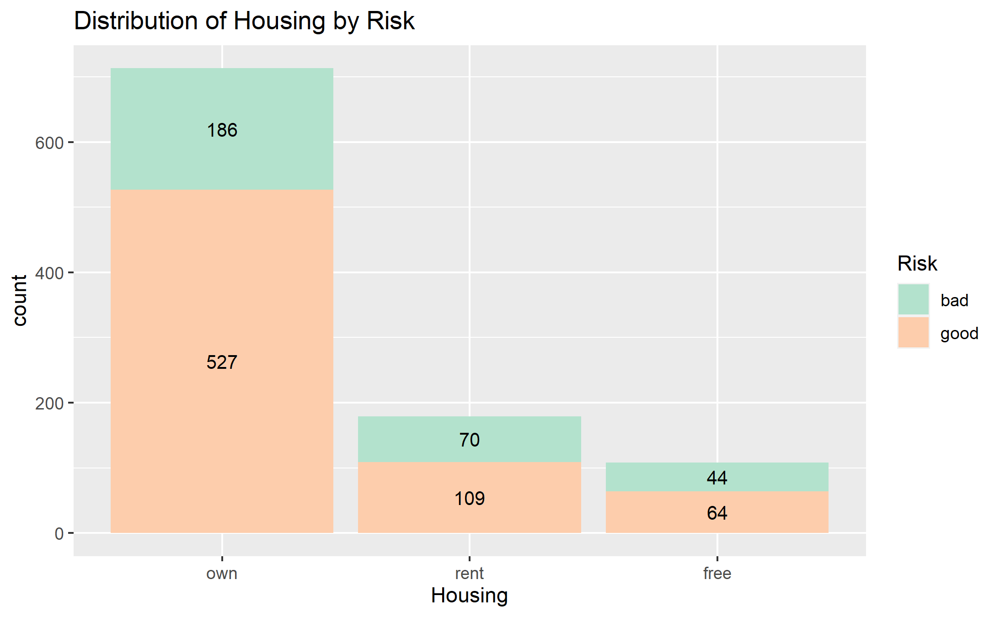

# Credit Risk EDA
*Analysis by Roy Kim*
The purpose of this project is to learn the basics of R through performing EDA on the German Credit dataset. To best view results, download the `eda.nb.html` notebook (at this [link](https://github.com/rbkim1990/credit_risk_eda/blob/main/notebooks/eda.nb.html)) and view in the browser of your choice.

# Folder Structure
data : folder that holds the German Credit dataset
images : folder that holds the visualizations that have been created by the notebook
notebooks : folder that holds the R notebook, as well as the accompanying HTML file

# Visualizations
Here is a sampling of some of the visualizations created

Visualizing the distribution of Age when grouped by Risk in a stacked histogram.

Visualizing the distribution of Housing when grouped by Risk.

# Next Steps
- Continue EDA with correlation analysis
- Create a classification model to predict Risk
